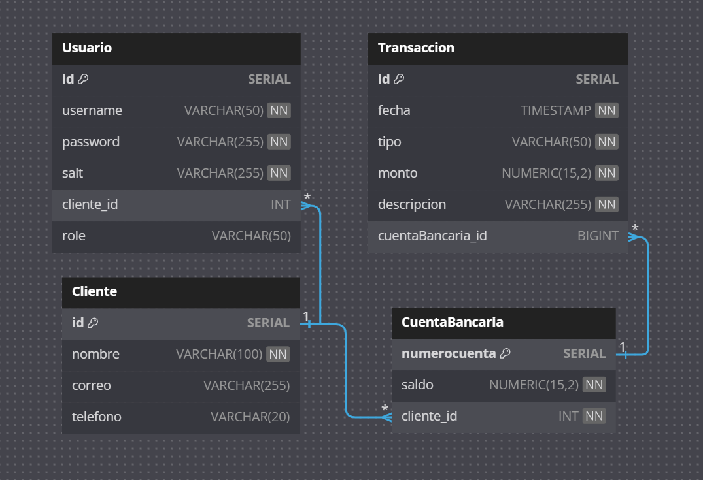

# Sistema Bancario

## Descripción

Simulador de sistema bancario desarrollado en Java que proporciona funcionalidades completas para la gestión de cuentas bancarias y transacciones. Incluye autenticación segura, hashing de contraseñas, y una gestión de roles diferenciada para administradores y usuarios. El sistema utiliza HikariCP para optimizar el rendimiento y la accesibilidad a la base de datos.

## Funcionalidades

### Autenticación
- **Autenticación de usuarios**: Permite el acceso seguro al sistema.
- **Hashing y salt de contraseñas**: Utiliza el algoritmo criptografico SHA-256 para asegurar las contraseñas.

### Roles
- **Administrador**:
  - Agregar nuevos administradores.
  - Eliminar clientes.
  - Modificar datos de clientes.
  - Cerrar sesión.

- **Usuario**:
  - Depositar dinero en cuentas propias.
  - Retirar dinero de cuentas propias.
  - Transferir dinero entre cuentas propias y de otros clientes.
  - Ver historial de transacciones en formato de tabla, con detalles como fecha, tipo, monto, descripción e ID de la cuenta.
  - Consultar saldos de todas las cuentas asociadas.
  - Abrir nuevas cuentas bancarias.
  - Cerrar cuentas bancarias, eliminando también sus transacciones.
  - Cerrar sesión.

### Características

- **HikariCP**: Implementación de un pool de conexiones para mejorar significativamente el rendimiento de acceso a la base de datos.
- **Patrón Singleton**: Gestión eficiente de la sesión del usuario, garantizando que solo una instancia de la sesión esté activa en cualquier momento.
- **Ordenamiento de tablas**: Funcionalidad que permite ordenar las tablas dinámicamente al hacer clic en los encabezados de las columnas.
- **Eliminación de transacciones**: Capacidad para que los usuarios eliminen todas sus transacciones de manera segura.
- **Edición de datos de usuario**: Permite a los usuarios actualizar su información personal (nombre, correo y teléfono), excepto el nombre de usuario, la contraseña y el ID de cliente.
- **Interfaz gráfica**: Diseñada con Swing para ofrecer una experiencia de usuario intuitiva y amigable.

### Base de Datos
A continuación se muestra el diagrama entidad-relación (ERD) que representa la estructura de la base de datos:

- **Relaciones**:
  - Cada `cliente` puede tener múltiples `cuentasBancarias`.
  - Cada `cuentaBancaria` puede tener múltiples `transacciones`.
  - Cada `usuario` está asociado a un único `cliente`.

## Requisitos

- **Java JDK 17 o superior**
- **Maven 3.9.8**
- **PostgreSQL 16.3 o superior**
- **Librerías de terceros**:
  - HikariCP 5.1.0
  - JDBC
  - Swing